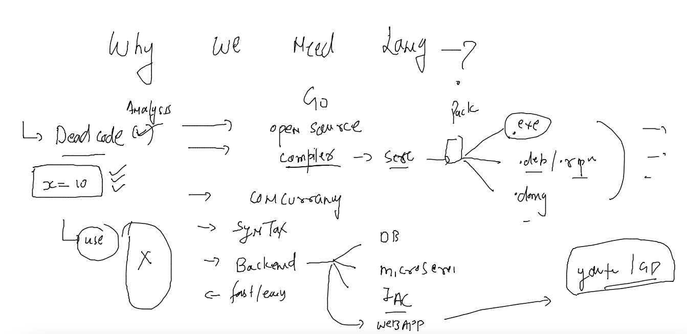

# oracle_golang_first_training

## Info About GO lang 



## always compile source code before you share -- 


### before you compile check env for setting purpose 


### build usage -- 

```

[ashu@ip-172-31-81-18 go_scode]$ GOOS="darwin" go build -o  maccode
[ashu@ip-172-31-81-18 go_scode]$ ls
Dockerfile  go.mod  linuxcode  maccode  main.go
[ashu@ip-172-31-81-18 go_scode]$ ./maccode 
bash: ./maccode: cannot execute binary file
[ashu@ip-172-31-81-18 go_scode]$ GOOS="windows" go build -o  wincode
[ashu@ip-172-31-81-18 go_scode]$ ls
Dockerfile  go.mod  linuxcode  maccode  main.go  wincode
[ashu@ip-172-31-81-18 go_scode]$ GOOS="windows" go build 
[ashu@ip-172-31-81-18 go_scode]$ ls
Dockerfile  go.mod  linuxcode  maccode  main.go  myapp.exe  wincode
[ashu@ip-172-31-81-18 go_scode]$ GOOS="windows" go build -o  microsoftcode.exe 
[ashu@ip-172-31-81-18 go_scode]$ cat go.mod 
module myapp

go 1.18

```

