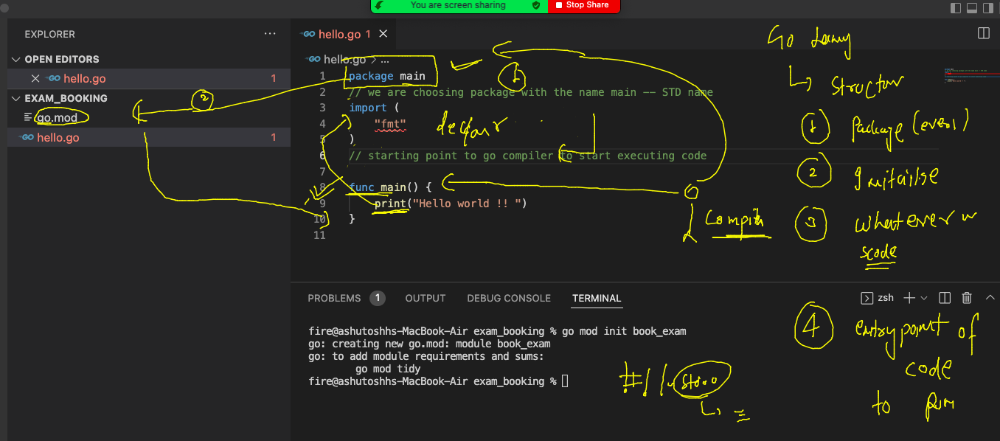

## writing & understanding first code

### choose any folder in vscode 

### before you write any code -- just initilize your project / module 

### it is similar to "git init"

### INitialize your project 

```
** go mod init book_exam**
go: creating new go.mod: module book_exam
go: to add module requirements and sums:
        go mod tidy
```

### Understanding go program structure and flow 



### first code in hello.go 

```
// package is manadatory 
package main
// declaration of things we are using under code 
import (
	"fmt" 
)

// go compiler will start the code from main function only 
func main() {
	// print without new line 
	fmt.Print("Hello world  !! ")
	// print with new line 
	fmt.Println("hello world with new line char..")
	fmt.Println("hello guys ..")

}
```

### compile and run 

```
 go  run  hello.go
Hello world  !! hello world with new line char..
hello guys ..
```
